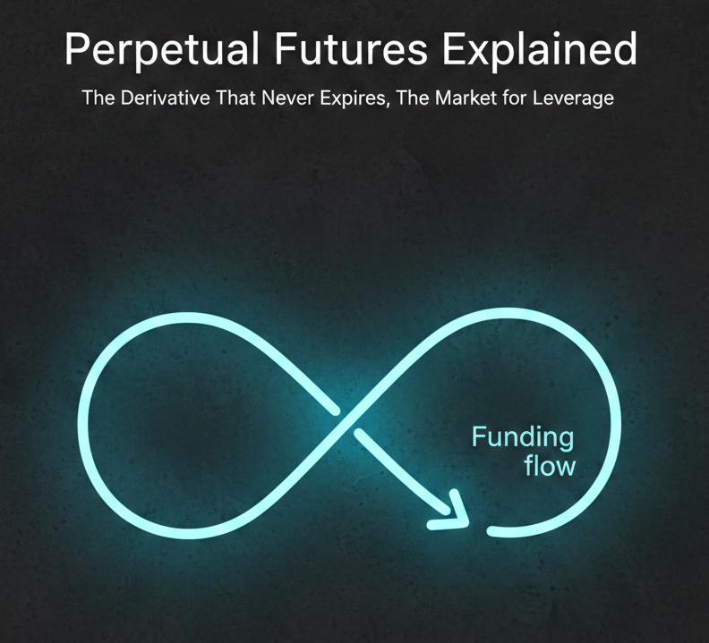

Perpetual futures have no expiry. Funding payments keep their price near spot and put a price on leveraged exposure.

---

Perpetual futures ("perps") let traders hold leveraged exposure without a fixed expiry. They look like futures, trade like futures, and offer clean linear exposure with leverage. But they never expire, and that design choice affects how prices stay near spot, where liquidity concentrates, and how funding rates price leverage.

I'll explain what perps are, how they differ from expiring futures, how funding works, and how leveraged positions can amplify price moves.

## Why perps exist

Traditional futures are a stack of contracts by maturity: March, June, September, and so on. That structure creates three annoying problems:

1. **Liquidity fragmentation.** Each maturity has its own order book.
2. **Roll friction.** You must close one contract and open the next, paying spreads and fees.
3. **Basis noise.** PnL can swing because the futures price decouples from spot, even if the underlying barely moves.

Perps eliminate expiry and roll friction while preserving linear leveraged exposure. Liquidity can concentrate in one contract per market and venue, although different exchanges still have separate books. You can hold a position while the contract remains listed and you meet its margin requirements. But if there is no expiry, how does the price stay tethered to spot?

That is where funding rates come in.

## What is a perpetual future?

A perp is a margined derivative with no scheduled expiration. I'll focus on a **linear contract**, whose profit or loss changes proportionally with price for a fixed position size. Inverse contracts have different payoff and collateral calculations.

Three prices matter: the **last traded price** records an execution, the **index price** aggregates reference-market prices, and the **mark price** estimates the contract's fair value for margin and unrealized PnL. They can differ. For example, [Hyperliquid's price documentation](https://hyperliquid.gitbook.io/hyperliquid-docs/trading/robust-price-indices) distinguishes its oracle and mark prices.

Key features:

- **No scheduled maturity.** Positions do not require routine expiry rolls.
- **Mark-price margining.** A venue can use its mark rather than the last trade to assess margin.
- **Funding transfers.** Payments between longs and shorts create incentives for the contract to stay near its reference market.
- **Venue-specific risk controls.** Centralized exchanges and on-chain protocols enforce margin and liquidations through different arrangements.
- **Concentrated liquidity.** Each contract can gather liquidity that dated futures would split across expirations.

## How It Differs from a Dated Future {#why-it-is-not-really-a-future}

A dated futures contract expires and settles according to its contract rules, linking its value to delivery or a specified settlement reference. A perp has no scheduled final settlement to force that convergence.

Instead, perps rely on **economic pressure** rather than **calendar convergence**. A persistent premium tends to increase funding paid by longs. That payment makes long positions more expensive and short positions more attractive, pulling the perp price down. A persistent discount tends to push funding in the opposite direction. The exact sign also depends on the funding formula and its other components.

You can think of funding as the ongoing cost of holding the position, though its sign can reverse and pay you instead. Calling it a forward would not resolve the distinction: ordinary forwards also specify a future settlement date.

## How Funding Keeps Prices Near Spot {#the-brilliance-of-funding-rates}

Funding payments help keep the perp price near spot without an expiration date. They also put a price on demand for leverage.

At a high level:

- **Positive funding:** longs pay shorts. A premium tends to push funding in this direction.
- **Negative funding:** shorts pay longs. A discount tends to push funding in this direction.

There is no universal funding formula. As one concrete example, [Bybit documents](https://www.bybit.global/en/help-center/article?id=000001123) the following structure, written here with clamp arguments in lower-bound, upper-bound order:

$$F=\operatorname{clamp}\left(\bar P+\operatorname{clamp}(I-\bar P,-d,d),F_{\min},F_{\max}\right).$$

Here $\bar P$ is an averaged premium index, $I$ is an interest component, and $d$ is a damping band. Define $\operatorname{clamp}(x,a,b)=\min(\max(x,a),b)$. In the documented example, $d=0.05\%$ and an eight-hour interval has $I=0.01\%$; some pairs use zero interest. The premium index uses impact bid/ask prices, not simply the last trade. Funding limits and intervals can change by market.

To understand a simple spot premium, suppose a perp trades at $\$50,500$ against an index of $\$50,000$:

$$\frac{50{,}500-50{,}000}{50{,}000}=0.01=1\%.$$

That measures a price difference. It is **not automatically the funding rate**, because averaging, the interest component, damping, and caps intervene. Positive funding can therefore coexist with a small discount, depending on those inputs.

For the payment example below, assume funding is charged every eight hours. Check whether a displayed rate is per interval or annualized before using it.

### Funding math in plain English

The rate determines how much longs and shorts pay each other. If you hold a perp position with notional value $N$ and the funding rate per period is $f$, your funding payment is simply:

$$
\begin{aligned}
    \text{Funding Payment} = N \times f
\end{aligned}
$$

Let's work through a concrete example. Suppose:

- **BTC perp price:** $\$50,000$
- **Position size:** $0.5$ BTC (you are long)
- **Notional:** $N = 0.5 \times 50,000 = \$25,000$
- **Funding rate:** $0.01\%$ per 8 hours $= 0.0001$

The funding payment is:

$$
\begin{aligned}
    \text{Payment} &= 25,000 \times 0.0001 \\ 
    &= \$2.50
\end{aligned}
$$

If you are long and funding is positive, **you pay $\$2.50$** to shorts every 8 hours. If you are short, **you receive $\$2.50$** from longs. Three funding periods per day means this could cost you $\$7.50$ daily, or about $\$2,738$ per year on a $\$25,000$ position, roughly $11\%$ annually.

Of course, funding rates fluctuate. They can go negative (shorts pay longs), near-zero during calm markets, or spike to extreme levels during mania. For scale, a hypothetical constant rate of $0.1\%$ every eight hours would equal $0.1\% \times 3 \times 365 = 109.5\%$ of notional per year without compounding. This is a rate conversion, not a forecast that funding stays fixed.

That tiny number is the **price of leverage**. It is the rent you pay to hold linear exposure with no expiry. And just like rent, it adds up if you are not paying attention.

### The market for leverage

The venue sets the formula, parameters, and settlement schedule. Market prices and order-book conditions supply inputs to that formula, so demand for leveraged exposure affects funding:

- **When everyone wants to be long** (bullish sentiment, FOMO, momentum), the perp price rises above spot. This tends to push funding positive, so **longs pay shorts**. Being levered long becomes expensive.
- **When everyone wants to be short** (bearish sentiment, panic, hedging), the perp price falls below spot. This tends to push funding negative, so **shorts pay longs**. Being levered short becomes expensive.

This is the market's self-balancing mechanism. It does not remove leverage demand, it **prices it**.

Think about the incentives this creates. If funding is extremely positive, you get paid to short. If it is extremely negative, you get paid to go long. This naturally attracts contrarian traders who fade the crowd, which pulls the perp price back toward spot.

The more one-sided the market becomes, the more expensive it is to be on that side, and the more you get paid to take the other side.

## How leverage actually works in perps

Perps are margined instruments, meaning you do not need to put up the full value of your position. You post collateral (initial margin), and the exchange lets you control a larger notional position.

Let:

- $P$ = perp price
- $Q$ = position size (in coins or contracts)
- $N = P \times Q$ = notional value of your position
- $M$ = margin you posted

Then leverage is simply:

$$
\begin{aligned}
    \text{Leverage} = \frac{N}{M}
\end{aligned}
$$

### A worked example

Suppose you want to go long BTC perps:

- **BTC perp price:** $\$50,000$
- **Position size:** $0.2$ BTC
- **Notional:** $N = 0.2 \times 50,000 = \$10,000$
- **Margin posted:** $M = \$1,000$

Your leverage is:

$$
\begin{aligned}
    \text{Leverage} = \frac{10,000}{1,000} = 10\times
\end{aligned}
$$

Now, if BTC moves up by $1\%$, your position gains $1\%$ of the notional value:

$$
\begin{aligned}
    \text{PnL} = N \times 1\% = 10,000 \times 0.01 = \$100
\end{aligned}
$$

That $\$100$ gain on a $\$1,000$ margin is a **10% return on your capital**. Your leverage amplified a $1\%$ market move into a $10\%$ portfolio move.

Of course, this works in reverse. A $1\%$ drop becomes a $-10\%$ loss. A $5\%$ drop is $-50\%$. A $-10\%$ move would exhaust that initial margin if no liquidation, fees, or funding intervened. In practice, maintenance margin generally triggers liquidation sooner.

### Maintenance Margin and Liquidation {#liquidation-and-the-cliff-edge}

**Maintenance margin** is the equity buffer required to keep a position open. It differs from initial margin, which is what you need to open the position. Liquidation is triggered when the relevant margin test fails, generally using a mark price. [Bybit distinguishes this from the bankruptcy price](https://www.bybit.com/en/help-center/article/FAQ-USDT-Perpetual-and-Expiry-Contracts), where position margin is exhausted.

For an isolated, linear long position, let the entry price be $P_0$, quantity $Q$, and initial margin $M=QP_0/L$, where $L$ is leverage. Ignore fees, funding, other collateral, and margin-tier changes. At mark price $P$, equity is:

$$E(P)=M+Q(P-P_0).$$

Setting equity to zero gives the **bankruptcy price**:

$$P_{\mathrm{bankrupt}}=P_0\left(1-\frac{1}{L}\right).$$

That is where the familiar adverse move of $-1/L$ comes from. To include maintenance margin, assume it is a constant fraction $m$ of current notional. Then liquidation begins when:

$$\begin{aligned}
M+Q(P_{\mathrm{liq}}-P_0)&=mQP_{\mathrm{liq}},\\
P_{\mathrm{liq}}(1-m)&=P_0-M/Q,\\
P_{\mathrm{liq}}&=\frac{P_0(1-1/L)}{1-m}.
\end{aligned}$$

For an illustrative $P_0=\$50{,}000$, $L=10$, and $m=0.005$:

$$P_{\mathrm{liq}}=\frac{50{,}000(0.9)}{0.995}\approx\$45{,}226.13.$$

The adverse move is about **9.55%**, before the **10%** move to the $45,000 bankruptcy price. This is a simplified model, not an exchange's executable risk calculator. Fees, funding, tiered maintenance requirements, and cross-margin balances change the trigger.

### The cascade effect

Here is where perps can amplify volatility. Liquidation can force a long position to sell or a short position to buy, adding pressure to the order book. It is not always an instant full market close: venues can use partial liquidations, transfers, and backstops. [Hyperliquid documents both order-book liquidation and a liquidator vault](https://hyperliquid.gitbook.io/hyperliquid-docs/trading/liquidations).

When price starts dropping and highly levered longs get liquidated, their forced selling pushes price lower, triggering more liquidations, creating more selling pressure, and so on. This is a **liquidation cascade**, and it is why you sometimes see brutal intraday moves in crypto that blow past technical levels and recover just as fast.

The same happens in reverse when shorts get squeezed. Forced buy-backs push price higher, liquidating more shorts, creating more buy pressure, rinse and repeat.

Forced liquidations can amplify a price move as leveraged positions close. That feedback helps explain why perp prices can move sharply relative to spot.

## Benefits and Risks of Perpetual Futures {#the-good-the-bad-and-the-weird}

### What perps solve

- **No maturity, no roll.** You never pay to roll a contract.
- **Fewer expiry buckets.** One contract can concentrate liquidity within a venue; tighter spreads still depend on trading activity and market makers.
- **Clean linear exposure.** PnL tracks the underlying move (plus funding).
- **Access depends on venue and jurisdiction.** Availability and leverage limits vary.

### Unintended effects

- **Funding becomes a tradeable signal and tax.** Traders fade extremes, or farm funding in neutral strategies.
- **Reflexive leverage cycles.** Positive funding encourages shorting, negative funding encourages longing, feeding cyclical positioning.
- **Liquidation cascades.** Forced liquidations can accelerate moves and create gaps.
- **Venue risk.** Centralized platforms introduce custody and operator risk; on-chain designs add protocol, oracle, and liquidation-system risks. Perps are not all centrally cleared.

There is also **ADL (auto-deleveraging)**, a last-resort mechanism some exchanges use to reduce risk when liquidations fail. It is rare in normal markets, but it is part of the system design and worth knowing exists.

## A simple mental model

Think of a perp as:

- A spot-like exposure
- Plus an embedded funding lease
- Subject to the venue’s settlement and margin rules

You are renting exposure at a floating rate. Sometimes the rate pays you. Sometimes it taxes you. Market conditions influence the rate; the venue defines how and when it is calculated and charged.

## Funding Costs and Liquidation Risk {#closing-thoughts}

Perps address liquidity fragmentation and roll friction through a shared structure: no scheduled expiry, mark-price margining, and a funding transfer that anchors price to spot.

But they also create a second market layered on top of price: the market for leverage. Funding is both a stabilizer and a signal, and the leverage it enables can be reflexive.

When a perp price moves sharply, funding rates and liquidations can help explain how leverage is contributing to the move.

As always, till next time.

JCP
