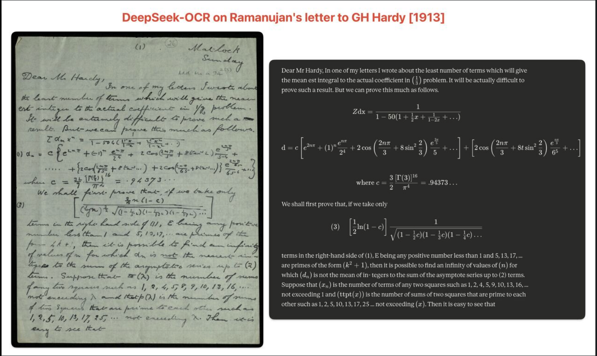

A breakthrough in optical character recognition (OCR) has profound implications for the future of LLMs.

---

Large language models are usually limited by how much text they can fit into their context windows. Every token matters. This is especially true when processing long PDFs, research papers, or codebases. But a recent breakthrough in optical character recognition (OCR) suggests something surprising: vision tokens may soon become a dramatically more efficient way to feed information to LLMs than text tokens.

In this article, I’ll explain what OCR actually is, how the technology evolved, what changed recently, and why this discovery might reshape the future of context.

## What the hell is an OCR?

OCR stands for Optical Character Recognition. It is the core technology that allows computers to convert real world documents, such as pdfs, images, and scanned paper documents, into machine-readable text. In other words, OCR transforms a messy visual input into a structured text representation that can be fed into other processes like LLMs. 

### A Brief History of OCR

OCR technology is not new, its history actually dates back to the 20th century. In the 1910s, Dr. Edmund Fournier d'Albe of Birmingham University developed the first ever OCR system, named the Optophone.

The Optophone was able to scan printed text and convert it into distinct sounds allowing for a blind user to recognize what characters were being scanned. The system was rule-based and relied on the physical height and width of characters to identify them.

Not much of significance happened with the technology until the 1950s, when developments in digital computers and light sensors allowed OCR to take off. OCR was no longer physical rules based systems and now involved using computers to run similarity algorithms evaluating which letters were present. IBM and RCA began to develop OCR technology for all sorts of tasks. IBM created the first commercially available scanner that could [read handwritten text](https://en.wikipedia.org/wiki/IBM_optical_mark_and_character_readers).

In the '60s and '70s, OCR became a key software for everything from the postal service sorting mail to banks processing checks (see [MICR](https://en.wikipedia.org/wiki/Magnetic_ink_character_recognition)). Even to this day OCR software is used all around the world in a vast array of commercial applications.

Modern developments in the 21st century involving neural networks have offered even more room for OCR improvement, as we will see with DeepSeekOCR. 

## DeepSeek OCR

Earlier this month, a Chinese hedge fund's AI lab, [DeepSeek](https://www.deepseek.com/en) released a [paper](https://www.arxiv.org/abs/2510.18234) outlining a new OCR model. Without even reading the paper, the initial community reaction was something along the lines of:

1. DeepSeek continues to enter a new market (OCR) and is killing it again (claiming 97%+ accuracy on general OCR benchmarks)  
2. OCR software is old, boring software that just turns writing/images into well formatted text and has many commercial applications for DeepSeek to monetize

I would say the initial read and public reception of this work is 100% correct. However, it misses the whole point of the paper! There is one core aspect which outlines why DeepSeek went through the trouble to make **yet another** OCR model.

### It's always been about context!

In the world of machine learning and natural language processing, **context is king**. The ability to understand and utilize context is what allows models to generate coherent and relevant responses.

Anyone who uses AI assistants learns quite quickly about the importance of context. Nothing is worse than chatting with the model for 10 minutes then having to start all over explaining a topic when you hit the context limit for the model. Eventually, you are forced to open a new ChatGPT or Claude tab and start the whole conversation all over again.

Here is the one fascinating thing I have not yet told you about the brand new DeepSeek OCR model: **vision tokens are dramatically more information-dense than text tokens** when representing documents.

Now this is an interesting development! Currently the largest LLM with strong performance and long context is the Gemini model, claiming 2 million tokens of context. Each token is approximately $\frac{1}{4}$ of a word. Given around 500 words per page, 2 million tokens of context gets you about 3,000 pages of context or about 1,500,000 words.  

In this paper, DeepSeek is stating that they can compress text tokens 10x when using them as vision tokens with very high accuracy. If this is true you could extend Gemini's context window from 2 million tokens to 20 million. 1.5 million words versus 15 million words, 3,000 pages versus 30,000 pages. This is like going from being able to see 1 volume of the Encyclopedia Britannica versus 12 volumes (the full 32 volumes are 50 Million words).

### What's the catch?

Well, I did say **if this is true** and currently it is not. Some language models understand vision tokens at high fidelity; however, this fidelity is not nearly on par with typical text. In order to achieve a full 10x of the context window the model would have to understand vision tokens just as well as it understands text tokens without decoding them back into text tokens (removing any compression benefit). Text has semantic meaning, typically previous words in a sentence have strong correlation with the future words in that same sentence. Vision tokens share this relationship but on a much smaller scale. Since the correlation to future tokens is so small, this leads to a much worse ability to generate coherent output.

There have been very interesting workarounds though and research in the space is ongoing. One pervasive thought in the industry right now is the idea of storing context in cached vision tokens, but only converting necessary context into text tokens for the model to actively use. This seems to be a plausible and reasonable future development of vision token compression.  

### Well, let's test it out! 

Last week the following was trending on both Twitter and Linkedin in relation to the new DeepSeek-OCR model. 

This looks shocking; the accuracy level seems to be very high even on complex handwritten mathematical formulas from over 100 years ago! This level of accuracy prompted (awful pun) a **healthy level of skepticism**. Let's test this ourselves and see how accurate it is on both the Ramanujan letter as well as some brand new handwriting of my own. 

#### DeepSeek-OCR result on letter to GH Hardy 1913

The following is the letter after being passed through DeepSeek-OCR at the highest compute setting, I used Google Colab with an A100 for this: 

-------------------------------- start --------------------------------

Dear Mr Hardy,

In one of my letters I wrote about the least number of terms which will give the mean
est integral to the actual coefficient in $\frac{1}{2}$ problem.
It will be actually difficult to prove such a result. But we can prove this much as follows.

equation:

$$
\begin{align*}
\sum a_n x^n &= \frac{1}{1-50(1-\frac{1}{2}x+\frac{1}{1-2x}+\cdots)} \\
a_n &= c \left[ e^{2n\pi} + (-1)^n \frac{e^{n\pi}}{2^5} + 2 \cos\left(\frac{2n\pi}{5} + 8(2n-1)\frac{e^{\frac{2n\pi}{5}}}{5} + \cdots\right) + 2 \cos\left(\frac{2n\pi}{5} + 8(3n-1)\frac{e^{\frac{2n\pi}{5}}}{5} + \frac{2n\pi}{5} + \cdots\right) \right]
\end{align*}
$$

equation:

$$
\begin{align*}
c = \frac{3}{2} \cdot \frac{[\Gamma(\frac{3}{2})]^6}{\pi^6} = .94373...
\end{align*}
$$

text:

We shall first prove that, if we take only

$$
\begin{align*}
\left[ \frac{3}{2} n(1-c) \right]^{\frac{1}{2}} \sqrt{(1-\frac{1}{2}n)(1-\frac{1}{4}n)(1-\frac{1}{8}n)\cdots}
\end{align*}
$$

text:

terms in the right-hand side of (1), E being any positive
number less than 1 and 5, 13, 17, ... are primes of the
form $4k+1$, then it is possible to find an infinity
of values of $n$ for which $dn$ is not the mean of in-
tegers to the sum of the asymptote series up to (2)
terms. Suppose that $a_n$ is the number of terms
of any two squares such as 1, 2, 4, 5, 9, 10, 13, 16, ...
not exceeding $\lambda$ and that $p(\lambda)$ is the number of sums
of two squares that are prime to each other such as
1, 2, 5, 10, 13, 17, 25 ... not exceeding $\lambda$. Then it is
easy to see that

* Special thank you to Trinity College for hosting this [letter](https://mss-cat.trin.cam.ac.uk/manuscripts/uv/view.php?n=add.ms.a.94&n=add.ms.a.94.2#?c=0&m=0&s=0&cv=5&xywh=-1944%2C0%2C8677%2C6006)

-------------------------------- end --------------------------------

Wow, that is some shocking levels of accuracy. This level of accuracy on handwritten text seems insane. Just to confirm this is not already seen in the training data of the model I will now run the model but with some awful handwriting of my own. This is a handwritten page of homework from college. Similar to the page above it contains a lot of scribbled math which would be hard for even me to decipher at times. 

Here is the homework page:

Here is the model output: 

-------------------------------- start --------------------------------

text:

middle term is zero. Since $E_{\epsilon}[\epsilon] = 0$

equation:

$$
\begin{align*}
E_x[(g_D - s(x))^{2}] + \sigma^{2}, \qquad
E_D!\left[(g_D - s(x))^{2}\right]
\end{align*}
$$

$$
\begin{align*}
= \left(E_D[g_D] - s(x)\right)^{2} + \mathrm{Var}_D(g_D) \
E\left[E_D(g_D)\right]
= E_x!\left[\text{bias}^{2} + \text{variance}\right] + \sigma^{2} \
= \text{bias}^{2} + \text{variance} + \sigma^{2}
\end{align*}
$$

text:

$$
E\left[E_D(g_D)\right]
= E_x!\left[\text{bias}^{2} + \text{variance}\right] + \sigma^{1}
= \text{bias}^{2} + \text{variance} + \sigma^{1}
$$

text:

(4)

equation:

$$
[
D = {(x_1, x_1^2), (x_2, x_2^2)}, \qquad
P = 1 = \mathrm{Dim}(D), \qquad
s(x) = x^{2}
]
$$

text:

union over $[-1, 1]$, $H = \mathrm{th}(h(x)) = ax + b$ for some $a,b \in \mathbb{R}$ and we wish to minimize Square Error!

text:

a) $a x_1 + b = x_1^2,\quad a x_2 + b = x_2^2$

equation:

$$
\begin{align*}
a x_1 + b - x_1^{2} &= a x_2 + b - x_2^{2} \
a x_1 - x_1^{2} &= a x_2 - x_2^{2} \
a(x_1 - x_2) &= x_1^{2} - x_2^{2} \
a(x_1 - x_2) &= (x_1 + x_2)(x_1 - x_2) \
a &= x_1 + x_2
\end{align*}
$$

equation:

$$
\begin{align*}
(x_1 + x_2)x_1 + b &= x_1^{2} \
x_1^{2} + x_1 x_2 + b &= x_2^{2} \
b &= -x_1 x_2
\end{align*}
$$

equation:

$$
[
\tilde{g}(x)
= E[h_0(x)]
= E[(x_1 + x_2)x - x_1 x_2]
= 0
]
$$

text:

B) To numerically estimate $g(x)$, $E_D(x)$, bias, and variance, I have devised the following estimator. First, generate many training sets $g(x_1, x_2)$ for values in uniform $[-1,1]$ space. Next we fit our hypothesis line to this data. The average of these hypothesis lines will be our estimate of $g(x)$.

text:

For each hypothesis we also compute

$$
[
E_D(x) = \frac{1}{n} \sum_{i=1}^{n} (g(x_i) - x_i^{2})
]
$$

text:

For every sample we solve this as follows:
$ \mathrm{Bias}(x) = (g(x) - x)^2 $, where $g(x)$ is always assumed.

text:

Our variance estimator will be:

$$
[
\mathrm{Var}(x)
= \frac{1}{n} \sum_{i=1}^{n} \left(g(x_i) - \tilde{g}(x_i)\right)^{2}.
]
$$

-------------------------------- end --------------------------------

For sure a lot more errors in this one in terms of OCR quality. On my handwriting the model frequently messes up what the power was of variables, exact forms of equations, confuses vectors, and more. Given this performance I would highly agree with the comments I have seen on social media that the letters from Ramanujan to GH Hardy were likely in the training set of the DeepSeekOCR model. Performance on my handwriting was still very strong, but clearly not to the caliber of a model that almost perfectly gets the scribbled handwriting from the Ramanujan letter. 

### Current use cases 

Naively, as a recent graduate who frequently had to write assignments in LaTeX (a mathematical formatting language) which was often time consuming given most of the math was worked out on paper (or iPad) already, I see some great use cases. 

1) Pass paper homework into DeepSeekOCR, convert to markdown. 
2) Ask LLM to convert markdown to LaTeX
3) Voila! You have saved ~an hour of writing your already-written homework into LaTeX!

Realistically this is not the true value of this model, but nonetheless a very interesting use case. The real value of this model is in converting large quantities of handwritten text into visual tokens as a medium (**of high information density and low loss**), instead of converting them directly into text tokens. If breakthroughs happen in how visual tokens can be used to train models directly, this paper will become seen as a seminal work in token density. Honestly, on a personal note, I hope there is more development in this space; the medium of visual tokens has much more to offer than asking SORA to generate you a video of Trump doing a backflip onto the White House lawn. 

As always, till next time.

JCP

