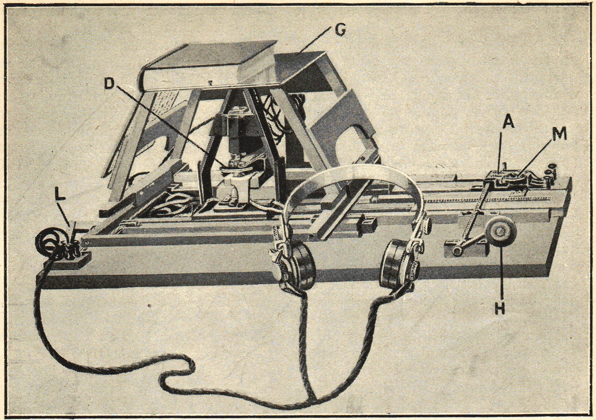
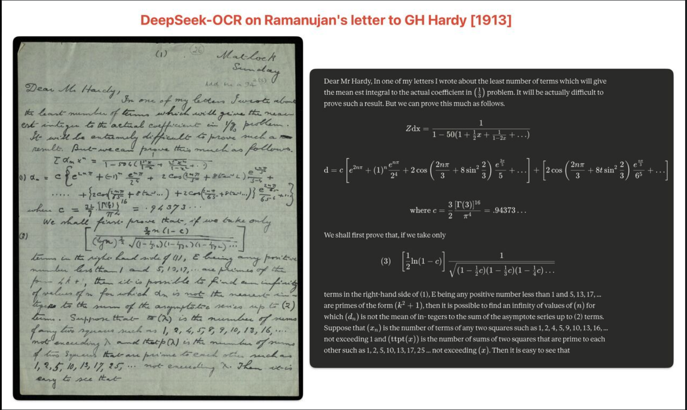
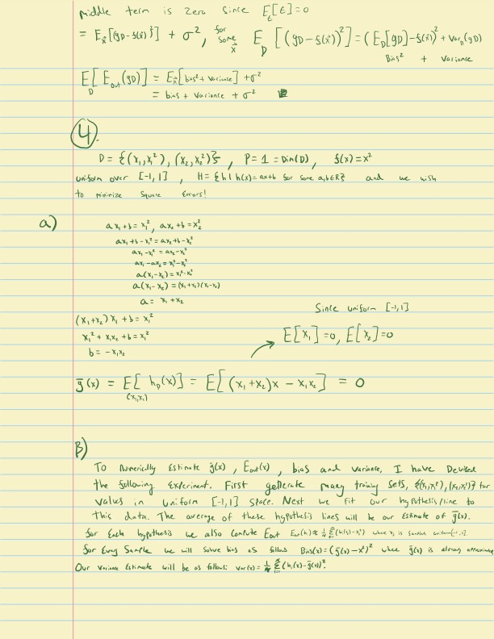

A breakthrough in optical character recognition (OCR) has profound implications for the future of LLMs.

---

Large language models are usually limited by how much text they can fit into their context windows. This limit is especially noticeable when processing long PDFs, research papers, or codebases. But a recent breakthrough in optical character recognition (OCR) suggests that vision tokens may soon become a more efficient way to feed information to LLMs than text tokens.

In this article, I’ll explain what OCR actually is, how the technology evolved, what changed recently, and how vision tokens might let models work with longer documents.

## What the hell is an OCR?

OCR stands for Optical Character Recognition. It is the core technology that allows computers to convert real world documents, such as PDFs, images, and scanned paper documents, into machine-readable text. In other words, OCR transforms a messy visual input into a structured text representation that can be fed into other processes like LLMs.

### A Brief History of OCR

An early optical reading aid was Edmund Fournier d'Albe's Optophone, described in his [1914 Nature article](https://www.nature.com/articles/094004b0). It converted patterns of light into sound for a listener to interpret, rather than producing machine-readable characters as modern OCR does.

The listener learned to associate its changing tones with the shapes of printed characters. That makes it a useful precursor to OCR, but calling it the first modern OCR system would blur an important distinction.

Later systems automated character recognition itself. The [1968 IBM product announcements](https://bitsavers.org/pdf/ibm/product_announcements/IBM_Product_Announcements_1968.pdf) describe optical readers for printed characters and handprinted numbers. Reading constrained numerals is a narrower task than transcribing arbitrary handwriting.

Modern systems can use neural networks for handwriting and document recognition, as described in [IBM's overview of OCR](https://www.ibm.com/think/topics/optical-character-recognition). DeepSeek OCR takes that document-processing task as a starting point for context compression.

## DeepSeek OCR

DeepSeek released its [OCR paper](https://arxiv.org/abs/2510.18234) on October 21, 2025. Its encoder turns a document image into vision tokens, and a language-model decoder reconstructs the text.

The reported **97% decoding precision** applies to experiments with text-to-vision-token compression below 10x. At 20x compression, the paper reports about **60% OCR accuracy**. Those figures describe reconstruction under particular test conditions, not a universal score for every document or a guarantee about reasoning over compressed text.

### Compressing Documents into Vision Tokens {#its-always-been-about-context}

Models use the information in their context windows to generate responses that are relevant to the conversation.

Long conversations can run into context limits. An assistant may truncate, summarize, or otherwise omit earlier details, and a new conversation may need those details supplied again.

The compression idea is to represent a document with fewer vision tokens than the text tokens needed to transcribe it. That could leave room for more input, provided the model can still use the information reliably.

For scale, take a hypothetical budget of 2 million tokens and assume **0.75 words per token** for the particular text. This conversion depends on the tokenizer and document; it is an illustrative assumption, not a fixed property of tokens.

$$2{,}000{,}000\ \text{tokens}\times0.75\ \frac{\text{words}}{\text{token}}=1{,}500{,}000\ \text{words}.$$

At 500 words per page:

$$\frac{1{,}500{,}000\ \text{words}}{500\ \text{words/page}}=3{,}000\ \text{pages}.$$

A hypothetical 10x reduction in input-token count would fit representations of 30,000 such pages into the same budget. That is storage arithmetic. It does not show that an existing assistant can read or reason over those pages with unchanged accuracy.

### What's the catch?

**Recovering text and using it to answer questions are different tests.** A low token count and a strong OCR score do not establish that a model will retrieve details, combine evidence, or follow instructions equally well from the compressed representation. Compression can lose information, and downstream reasoning needs its own evaluation.

If we decode every page and place all the recovered text back into the context window, we again pay for those text tokens. One possible design would keep document images available and decode selected passages when needed. That would introduce retrieval decisions and processing costs; it is a proposed use here, not a demonstrated 10x expansion of another model's context window.

### Well, let's test it out! 

I saw the following example circulated on social media. I could not establish the original demonstration’s settings, so I ran my own test below.

This looks shocking; the accuracy level seems to be very high even on complex handwritten mathematical formulas from over 100 years ago! This level of accuracy prompted (awful pun) a **healthy level of skepticism**. Let's test this ourselves and see how accurate it is on both the Ramanujan letter as well as some brand new handwriting of my own. 

#### DeepSeek-OCR result on letter to GH Hardy 1913

The following is the letter after being passed through DeepSeek-OCR at the highest compute setting, I used Google Colab with an A100 for this: 

-------------------------------- start --------------------------------

Dear Mr Hardy,

In one of my letters I wrote about the least number of terms which will give the mean
est integral to the actual coefficient in $\frac{1}{2}$ problem.
It will be actually difficult to prove such a result. But we can prove this much as follows.

equation:

$$
\begin{align*}
\sum a_n x^n &= \frac{1}{1-50(1-\frac{1}{2}x+\frac{1}{1-2x}+\cdots)} \\
a_n &= c \left[ e^{2n\pi} + (-1)^n \frac{e^{n\pi}}{2^5} + 2 \cos\left(\frac{2n\pi}{5} + 8(2n-1)\frac{e^{\frac{2n\pi}{5}}}{5} + \cdots\right) + 2 \cos\left(\frac{2n\pi}{5} + 8(3n-1)\frac{e^{\frac{2n\pi}{5}}}{5} + \frac{2n\pi}{5} + \cdots\right) \right]
\end{align*}
$$

equation:

$$
\begin{align*}
c = \frac{3}{2} \cdot \frac{[\Gamma(\frac{3}{2})]^6}{\pi^6} = .94373...
\end{align*}
$$

text:

We shall first prove that, if we take only

$$
\begin{align*}
\left[ \frac{3}{2} n(1-c) \right]^{\frac{1}{2}} \sqrt{(1-\frac{1}{2}n)(1-\frac{1}{4}n)(1-\frac{1}{8}n)\cdots}
\end{align*}
$$

text:

terms in the right-hand side of (1), E being any positive
number less than 1 and 5, 13, 17, ... are primes of the
form $4k+1$, then it is possible to find an infinity
of values of $n$ for which $dn$ is not the mean of in-
tegers to the sum of the asymptote series up to (2)
terms. Suppose that $a_n$ is the number of terms
of any two squares such as 1, 2, 4, 5, 9, 10, 13, 16, ...
not exceeding $\lambda$ and that $p(\lambda)$ is the number of sums
of two squares that are prime to each other such as
1, 2, 5, 10, 13, 17, 25 ... not exceeding $\lambda$. Then it is
easy to see that

* Special thank you to Trinity College for hosting this [letter](https://mss-cat.trin.cam.ac.uk/manuscripts/uv/view.php?n=add.ms.a.94&n=add.ms.a.94.2#?c=0&m=0&s=0&cv=5&xywh=-1944%2C0%2C8677%2C6006)

-------------------------------- end --------------------------------

To compare another sample, I'll run the model on some awful handwriting of my own. This does not test training-set membership, but it lets me inspect performance on a different page. This is a handwritten page of homework from college. Similar to the page above it contains a lot of scribbled math which would be hard for even me to decipher at times.

Here is the homework page:

Here is the model output: 

-------------------------------- start --------------------------------

text:

middle term is zero. Since $E_{\epsilon}[\epsilon] = 0$

equation:

$$
\begin{align*}
E_x[(g_D - s(x))^{2}] + \sigma^{2}, \qquad
E_D!\left[(g_D - s(x))^{2}\right]
\end{align*}
$$

$$
\begin{align*}
= \left(E_D[g_D] - s(x)\right)^{2} + \mathrm{Var}_D(g_D) \
E\left[E_D(g_D)\right]
= E_x!\left[\text{bias}^{2} + \text{variance}\right] + \sigma^{2} \
= \text{bias}^{2} + \text{variance} + \sigma^{2}
\end{align*}
$$

text:

$$
E\left[E_D(g_D)\right]
= E_x!\left[\text{bias}^{2} + \text{variance}\right] + \sigma^{1}
= \text{bias}^{2} + \text{variance} + \sigma^{1}
$$

text:

(4)

equation:

$$
[
D = {(x_1, x_1^2), (x_2, x_2^2)}, \qquad
P = 1 = \mathrm{Dim}(D), \qquad
s(x) = x^{2}
]
$$

text:

union over $[-1, 1]$, $H = \mathrm{th}(h(x)) = ax + b$ for some $a,b \in \mathbb{R}$ and we wish to minimize Square Error!

text:

a) $a x_1 + b = x_1^2,\quad a x_2 + b = x_2^2$

equation:

$$
\begin{align*}
a x_1 + b - x_1^{2} &= a x_2 + b - x_2^{2} \
a x_1 - x_1^{2} &= a x_2 - x_2^{2} \
a(x_1 - x_2) &= x_1^{2} - x_2^{2} \
a(x_1 - x_2) &= (x_1 + x_2)(x_1 - x_2) \
a &= x_1 + x_2
\end{align*}
$$

equation:

$$
\begin{align*}
(x_1 + x_2)x_1 + b &= x_1^{2} \
x_1^{2} + x_1 x_2 + b &= x_2^{2} \
b &= -x_1 x_2
\end{align*}
$$

equation:

$$
[
\tilde{g}(x)
= E[h_0(x)]
= E[(x_1 + x_2)x - x_1 x_2]
= 0
]
$$

text:

B) To numerically estimate $g(x)$, $E_D(x)$, bias, and variance, I have devised the following estimator. First, generate many training sets $g(x_1, x_2)$ for values in uniform $[-1,1]$ space. Next we fit our hypothesis line to this data. The average of these hypothesis lines will be our estimate of $g(x)$.

text:

For each hypothesis we also compute

$$
[
E_D(x) = \frac{1}{n} \sum_{i=1}^{n} (g(x_i) - x_i^{2})
]
$$

text:

For every sample we solve this as follows:
$ \mathrm{Bias}(x) = (g(x) - x)^2 $, where $g(x)$ is always assumed.

text:

Our variance estimator will be:

$$
[
\mathrm{Var}(x)
= \frac{1}{n} \sum_{i=1}^{n} \left(g(x_i) - \tilde{g}(x_i)\right)^{2}.
]
$$

-------------------------------- end --------------------------------

There are more visible errors in my homework sample: the model gets exponents and equations wrong and confuses vectors. That is useful evidence about these two outputs, but it does not tell us whether the Ramanujan letter was in the training set. Handwriting, image quality, layout, and familiarity with mathematical expressions could all affect the comparison.

I did not score these transcriptions against a verified ground truth. They are qualitative examples, not an accuracy benchmark or a memorization test. The raw outputs above are left as produced, including their errors.

### Current use cases 

As a recent graduate, I frequently had to write assignments in LaTeX (a mathematical formatting language). This often took time because I had already worked out most of the math on paper or an iPad. OCR could help with that:

1) Pass paper homework into DeepSeekOCR, convert to markdown. 
2) Ask LLM to convert markdown to LaTeX
3) Compare the result with the original page and correct the equations before using it. This could save transcription time, but the output still needs checking.

Beyond transcribing homework, the model could convert large quantities of handwritten text into visual tokens as a compressed representation, with the amount of information lost depending on the compression setting and document, instead of converting them directly into text tokens. I hope there is more development in this space; the medium of visual tokens has much more to offer than asking SORA to generate you a video of Trump doing a backflip onto the White House lawn.

As always, till next time.

JCP

