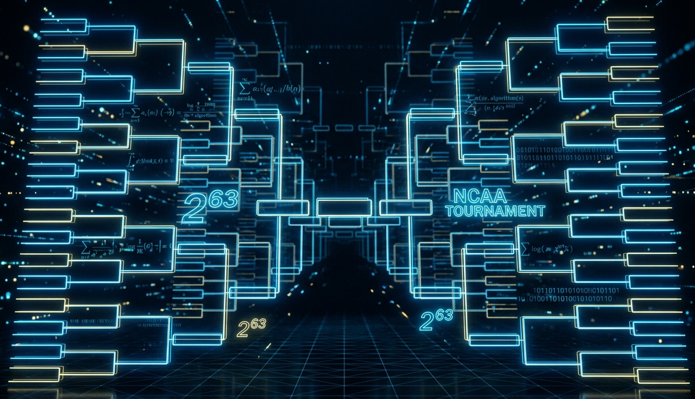

The odds of a perfect March Madness bracket are 1 in 9.2 quintillion. Warren Buffett bet a billion dollars on it, and he was never worried about paying out.

---

Every March, millions of people fill out NCAA Basketball brackets convinced that this is their year. In 2014, Warren Buffet [offered a billion dollars](https://www.espn.com/blog/collegebasketballnation/post/_/id/92892/buffet-a-billion-dollars-for-perfect-bracket) to anyone who could pick every one of the 63 games correctly. Kalshi has revived this offer by running the [same bet this year](https://kalshi.com/billion-dollar-bracket), backed by some of the sharpest minds in trading at [SIG](https://sig.com/). Here is the quick math explaining why everyone offering this "prize" knows they are never going to pay it out. 

## The Structure of the Bracket

The NCAA Tournament's main bracket involves 64 teams competing across six rounds. Each game has exactly two possible outcomes. That means the bracket is a sequence of binary decisions, a string of ones and zeros, one bit per game.

How many games are there? In a single-elimination tournament with 64 teams, every game eliminates exactly one team. To go from 64 to 1 champion, you need to eliminate 63 teams. Therefore: 63 games, 63 binary decisions. 

$$\text{Total possible brackets} = 2^{63}$$

That resolves to:

$$9{,}223{,}372{,}036{,}854{,}775{,}808$$

Nine quintillion, two hundred twenty-three quadrillion, roughly $9.2 \times 10^{18}$.

For reference, that number is ~22.5 Million times larger than the number of stars in the Milky Way. Let that land for a second.

## The Billion Dollar Bets

In 2014, Warren Buffett and Quicken Loans offered [$1 billion](https://www.espn.com/blog/collegebasketballnation/post/_/id/92892/buffet-a-billion-dollars-for-perfect-bracket) to anyone who could submit a perfect bracket. The prize was backed by Berkshire Hathaway. Buffett, who has made a career out of understanding risk better than almost anyone alive, was not worried about paying out. By the end of the contest the ~8 million entrants did not come close to perfection.

This March, Kalshi launched a similar challenge: a **$1 billion prize** for a perfect bracket, backed in part by Susquehanna International Group ([SIG](https://sig.com/)), one of the most sophisticated quantitative trading firms in the world. SIG is not known for charitably giving away their prop trading capital base within the context of markets. They are known for pricing risk extremely precisely and taking the other side of bets when the odds are overwhelmingly in their favor.

When a firm full of people who do math for a living are happy to insure your perfect bracket for a shot at a billion dollars, you should pay attention to what they're implying about the probability.

They are, in the most literal sense, selling insurance against an event they know will almost certainly never happen. The expected payout is so close to zero that the marketing value of the promotion likely exceeds the actuarial risk. That's not a criticism, that's just elegant business. But it tells you something important about the numbers underneath.

## What Are the Chances of a Perfect Bracket?

The 1-in-9.2-quintillion figure assumes pure randomness, one coin flip per game. It is also only the probability for just one bracket being perfect. In reality, we are concerned with the probability that **many brackets are all not perfect brackets**! In the case of the Buffett/Quicken Loans contest there were millions of brackets. At its peak roughly 8 million people entered, all of them with at least some knowledge of basketball (and thus potentially better than 50% odds of guessing a given game). So let's ask the right question:

> With 8 million entrants picking at different levels of skill (probability of guessing games correctly), what's the probability that at least one of them ended up with a perfect bracket?

Each individual bracket has a:

$$P(\text{Perfect Bracket | Random choosing}) = \frac{1}{2^{63}} =  0.5^{63} = \frac{1}{9.22 \times 10^{18}}$$

With 8 million entrants, the probability that at least one submits a perfect bracket is:

$$P(\text{At least one perfect | 8,000,000 entrants}) = 1 - P(\text{No perfect bracket | 8,000,000 entrants})$$

$$P(\text{No perfect brackets | 8,000,000 entrants}) = (1 - P(\text{One perfect bracket}))^\text{8,000,000 entrants}$$

Putting all of this together we get the following: 

$$P(\text{At least one perfect | 8,000,000 entrants}) = 1 - (1 - P(\text{One perfect bracket}))^\text{8,000,000 entrants} $$

When choosing randomly. This ended up being ~0.00000000008%, about 10 trillion to 1 odds. Buffett was insuring 1-in-10-trillion odds bet for a billion dollars. Not exactly a nail-biter. The EV of this 1 Billion dollar liability is about **$0.0001 dollars**. In other words, if someone offered you this deal and said they would pay you a penny to run the contest, you should be very excited to say yes. 

8 million people was the 2014 figure but what about with this years 36 million brackets. I know its likely there are fewer unique brackets (many users picking similar brackets) but lets evaluate as if the worst scenario is among us (as insurers).

Let's also give the entrants some credit. Suppose every one of those 8 or 36 million people had genuine edge, correctly predicting each game with 55%, 60%, or even 70% accuracy! Better than most people, even better than most statistical models. Their per-bracket odds become:

$$0.55^{63} \approx 4.39 \times 10^{-17}$$

$$0.60^{63} \approx 1.05 \times 10^{-14}$$

$$0.70^{63} \approx 1.74 \times 10^{-10}$$

These odds are as follows, 55% -> 1 in 23 quadrillion, 60% -> 1 in 100 trillion, 70% -> 1 in 5 billion.

This year there were 36 million total brackets, however the Kalshi contest was limited to a mere 10 million brackets. Given all of these entrants and the potential for skilled bracket creation Kalshi contest the numbers shift, but not enough to make anyone at SIG nervous. Here's the full picture across skill levels and pool sizes:

| Accuracy per game | Odds, one bracket | Odds with 8M entrants | Odds with 36M entrants | EV of $1B (10M entrants) | EV of $1B (36M entrants) |
|-------------------|-------------------|-----------------------|------------------------|--------------------------|--------------------------|
| 50% (random) | 1 in 9.2 quintillion | 1 in 1.15 trillion | 1 in 256 billion | $0.001 | $0.004 |
| 55% | 1 in 23 quadrillion | 1 in 2.85 billion | 1 in 633 million | $0.44 | $1.58 |
| 60% | 1 in 95 trillion | 1 in 12 million | 1 in 2.6 million | $106 | $380 |
| 67% | 1 in 90.6 billion | 1 in 9,064 | 1 in 2,518 | $110,329 | $397,126 |
| 70% | 1 in 5.7 billion | 1 in 718 | 1 in 160 | $1,740,998 | $6,253,419 |

The 70% row is where things start to look interesting, 1-in-160 with 36 million entrants is a number that would make an insurer sweat (obviously depending on how much money you were paid for the contract). On the far right hand side you can see the expected value of the $1 Billion dollar liability at every probability level. If the prediction accuracy per game is worse than 67% and there are less than 10M entrants, you should feel relatively comfortable accepting between $100 and $100,000. This range is quite wide but depends heavily on the inputs. 

But nobody (especially not your average Joe) predicts March Madness at 67% per game. The whole point of the tournament is that upsets happen constantly and unpredictably. A 12-seed beats a 5-seed roughly a third of the time. Cinderella stories aren't anomalies, they're the product. The bracket is essentially designed to punish sustained accuracy, which is exactly why billion-dollar prize offers are such comfortable positions to be in.

## How Much Storage Would Every Bracket Require?

Here is a very fun hypothetical, lets say I now let you generate every single bracket possible but you have to have it stored somewhere in a physical location (computer memory is allowed). I will still offer the same deal. One Billion dollars if you generate the perfect bracket! But, now there is a catch:

>I will only pay you the billion dollars if you have every single bracket stored somewhere.

You laugh and jump in joy thinking of the yachts and super cars you will buy with your fortune. 

First, let's make the number concrete. Each bracket requires exactly 63 bits of data, one bit per game outcome. So the total storage to represent every possible bracket is:

$$63 \text{ bits} \times 2^{63} \text{ brackets} = 581,072,438,321,850,875,904 \text{ bits}$$

Let's convert that into something recognizable:

| Unit | Value |
|------|-------|
| Bits | $\approx 5.81 \times 10^{20}$ |
| Bytes | $\approx 7.26 \times 10^{19}$ |
| Gigabytes (GB) | $\approx 72{,}634{,}054{,}790$ GB |
| Terabytes (TB) | $\approx 72{,}634{,}055$ TB |
| Petabytes (PB) | $\approx 72{,}634$ PB |
| **Exabytes (EB)** | **$\approx 72.6$ EB** |

To put that in context: as of 2025, this figure would be at least **10% of global AWS storage**.  

We're not in terabyte territory (or even petabyte for that matter). We're in exabyte territory. That's 72,600 terabytes just to store the bracket data, to say nothing of the hardware, indexing, or retrieval infrastructure needed to actually use it.

I had Opus 4.6 (LLM) generate a cost estimate for writing, storing, and retrieving this data. It came up with a figure in the 4-10 billion dollar range. 

## The Lottery Comparison

Most people intuitively understand that the lottery is hard to win. The odds of winning Powerball are roughly 1 in 292 million. That feels impossibly small.

The odds of randomly picking a perfect bracket are 1 in 9.2 quintillion. That's roughly **31 billion times harder than winning Powerball**.

Let's try another angle. If every person on Earth (all 8 billion of us) filled out one bracket per second, continuously, the expected time to exhaust all possible combinations would be approximately:

$$\frac{2^{63}}{8 \times 10^9 \text{ people} \times 3.156 \times 10^7 \text{ seconds/year}} \approx 36.5 \text{ years}$$

About 36 and a half years. Every person on Earth filling out a bracket every single second would need the better part of a lifetime to exhaust all combinations. And that assumes nobody sleeps.

## What SIG and Buffett Actually Know

There's a useful framing from insurance that applies here. An insurer takes on a probability of loss in exchange for a premium today. The math only works if the premium is priced above the expected loss. If the expected loss is $0, any premium at all is pure margin.

When Buffett offered $1 billion for a perfect bracket, the actuarial cost of that promise was basically zero. The probability that any entrant would submit a perfect bracket, even with millions of entries, was vanishingly small. You don't need a billion dollars in reserves when your expected payout rounds to nothing.

SIG knows this game cold. They make markets in options and other derivatives, where pricing low-probability events accurately is literally the job. Running a billion dollar bracket challenge backed by SIG is not a bet on sports. It's a bet on math. And the math is so one-sided that the promotional upside of running the contest dwarfs any actuarial concern about the payout.

The same logic applies to why bracket challenges in general are financially sound for the people running them. Even offering a $1 million prize for a perfect bracket, with millions of entrants, the expected payout is trivially small. You're not insuring against a hurricane. You're insuring against something that has never happened and almost certainly will not happen in any of our lifetimes.

## Takeaways

The impossible bracket is a beautiful collision of combinatorics and human optimism. A few things worth holding onto:

- The number of possible brackets, $2^{63}$, is large enough to break human intuition, exceed practical storage capacity, and make brute-force approaches absurd.
- Smart money, from Buffett to SIG, has been happy to offer billion-dollar prizes because the expected cost is essentially zero. When that many smart people are on one side of a bet, it's worth understanding why.
- Skill helps. A 70% accurate predictor has odds of 1 in 700,000 rather than 1 in 9 quintillion. But 1 in 700,000 is still not good.
- The annual ritual of filling out brackets is not irrational. Bracket pools are won by people who pick better than average, not by people who pick perfectly. You don't need a perfect bracket to win your office pool. You just need to be right more often than everyone else. That's a very different problem.

The March Madness bracket is a masterclass in why we're bad at big numbers. We hear "9.2 quintillion" and nod, but we don't really feel it. The storage math helps. The lottery comparison helps. The Buffett angle helps. But ultimately, $2^{63}$ is just genuinely bigger than our intuition is built to handle, and no amount of explanation fully closes that gap.

Which is, honestly, part of what makes March so fun.

---

*Note: This analysis covers the standard 64-team single-elimination bracket with 63 games. The NCAA Tournament's First Four play-in games add 4 more decision points, bringing the true total closer to $2^{67}$, roughly 147 quintillion. We'll leave that as an exercise for the truly deranged.*
