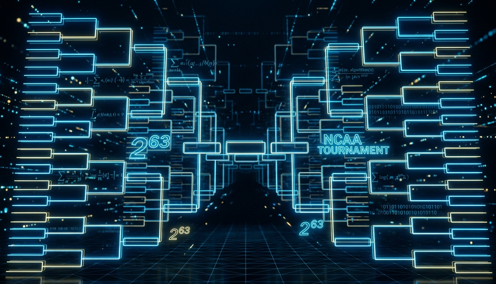

With independent coin-flip picks, the odds of a perfect March Madness bracket are 1 in 9.2 quintillion. Warren Buffett offered a billion dollars for one, a promotion with a very low expected payout.

---

Every March, millions of people fill out NCAA Basketball brackets convinced that this is their year. In 2014, Warren Buffett [offered a billion dollars](https://www.espn.com/blog/collegebasketballnation/post/_/id/92892/buffet-a-billion-dollars-for-perfect-bracket) to anyone who could pick every one of the 63 games correctly. Kalshi has revived this offer by running the [same bet this year](https://kalshi.com/billion-dollar-bracket), backed by trading firm [SIG](https://sig.com/). Here is the math behind the low expected cost of offering this "prize".

## The Structure of the Bracket

The NCAA Tournament's main bracket involves 64 teams competing across six rounds. Each game has exactly two possible outcomes. That means the bracket is a sequence of binary decisions, a string of ones and zeros, one bit per game.

How many games are there? In a single-elimination tournament with 64 teams, every game eliminates exactly one team. To go from 64 to 1 champion, you need to eliminate 63 teams. Therefore: 63 games, 63 binary decisions. 

$$\text{Total possible brackets} = 2^{63}$$

That resolves to:

$$9{,}223{,}372{,}036{,}854{,}775{,}808$$

Nine quintillion, two hundred twenty-three quadrillion, roughly $9.2 \times 10^{18}$.

That is the number of complete outcome patterns in this 63-game model. It counts possibilities; it does not say that real basketball makes each pattern equally likely.

## The Billion Dollar Bets

The [Kalshi announcement](https://news.kalshi.com/p/kalshi-billion-dollar-perfect-bracket-challenge) recalls Buffett and Quicken Loans' 2014 billion-dollar challenge, which ended without a perfect bracket. It also identifies SIG Parametrics, LLC, a member of Susquehanna International Group, as the financial backer of Kalshi's 2026 promotion.

Kalshi's [published rules](https://kalshi.com/docs/bracket-challenge/OFFICIAL_RULES.pdf) initially cap entries at 10 million, subject to an increase announced on the site. Multiple perfect entries share one $1 billion grand prize; it is not $1 billion per winner. The rules also allow payment in ten annual installments. Separately, the announcement promises a best-bracket prize and charitable donations. These details matter when estimating the total cost.

## What Are the Chances of a Perfect Bracket?

The 1-in-9.2-quintillion figure applies to a bracket generated by independent fair coin flips. It does not describe every skilled entrant. Let's first use a deliberately simple model with **8 million independently generated random brackets**. This is an illustrative pool size, not a verified count of entries in a particular contest.

Each individual bracket has a:

$$P(\text{Perfect Bracket | Random choosing}) = \frac{1}{2^{63}} =  0.5^{63} = \frac{1}{9.22 \times 10^{18}}$$

Under those independent random-pick assumptions, the probability that at least one of 8 million entries is perfect is:

$$P(\text{At least one perfect | 8,000,000 entrants}) = 1 - P(\text{No perfect bracket | 8,000,000 entrants})$$

$$P(\text{No perfect brackets | 8,000,000 entrants}) = (1 - P(\text{One perfect bracket}))^\text{8,000,000 entrants}$$

Putting all of this together we get the following: 

$$P(\text{At least one perfect | 8,000,000 entrants}) = 1 - (1 - P(\text{One perfect bracket}))^\text{8,000,000 entrants} $$

This is approximately $8.67\times10^{-13}$, or $0.0000000000867\%$, about 1 in 1.15 trillion. A nominal $1 billion prize paid once if anybody wins has an expected payout of about **$0.000867** in this random-pick model. That is not an estimate of the actual insurer's price or the promotion's total cost.

Now suppose, as a sensitivity exercise, that each pick is correct with probability $q$, independently across all 63 games. Then one bracket succeeds with probability $q^{63}$:

$$0.55^{63}\approx4.39\times10^{-17},\qquad0.60^{63}\approx1.06\times10^{-14},\qquad0.70^{63}\approx1.74\times10^{-10}.$$

An observed average prediction accuracy does not by itself justify this exponentiation. Later matchups depend on earlier results, and prediction errors can be related. We are assuming a common independent success rate, not estimating one from tournament data.

For the table, additionally pretend that different entries' perfect-bracket events are independent, so $P(\text{any winner})=1-(1-q^{63})^n$. The 8M and 36M columns are hypothetical pool sizes; 10M corresponds to the published initial entry cap. Expected payouts use a shared **nominal** $1 billion prize, excluding other awards and ignoring installment discounting.

| Assumed independent accuracy per game | Odds, one bracket | Odds with 8M entries | Odds with 36M entries | Expected $1B payout (10M entries) | Expected $1B payout (36M entries) |
|---|---|---|---|---|---|
| 50% (random) | 1 in 9.2 quintillion | 1 in 1.15 trillion | 1 in 256 billion | $0.001 | $0.004 |
| 55% | 1 in 23 quadrillion | 1 in 2.84 billion | 1 in 632 million | $0.44 | $1.58 |
| 60% | 1 in 95 trillion | 1 in 11.8 million | 1 in 2.63 million | $106 | $380 |
| 67% | 1 in 90.6 billion | 1 in 11,330 | 1 in 2,518 | $110,329 | $397,126 |
| 70% | 1 in 5.74 billion | 1 in 718 | 1 in 160 | $1,740,998 | $6,253,419 |

**Real entries share one tournament.** Once brackets are submitted, two distinct complete brackets cannot both be perfect. Duplicate brackets win or lose together. Those events are not independent.

For a fixed set of distinct submitted brackets $B$, the actual probability of a winner is:

$$P(\text{any winner})=\sum_{b\in B}P(\text{tournament outcome}=b).$$

If all $2^{63}$ outcomes were equally likely, this would be exactly $|B|/2^{63}$. With real teams, each outcome has its own probability. Shared favorite picks, duplicates, and matchup dependencies require a joint tournament model. The table shows sensitivity to assumptions; it should not be used as a quote for insuring the contest.

## How Much Storage Would Every Bracket Require?

Here is a very fun hypothetical, lets say I now let you generate every single bracket possible but you have to have it stored somewhere in a physical location (computer memory is allowed). I will still offer the same deal. One Billion dollars if you generate the perfect bracket! But, now there is a catch:

>I will only pay you the billion dollars if you have every single bracket stored somewhere.

First, let's make the number concrete. Assume we explicitly store every complete bracket as an uncompressed 63-bit record, packed without byte padding. The raw storage is then:

$$63 \text{ bits} \times 2^{63} \text{ brackets} = 581,072,438,321,850,875,904 \text{ bits}$$

Let's convert that into something recognizable:

| Unit | Value |
|------|-------|
| Bits | $\approx 5.81 \times 10^{20}$ |
| Bytes | $\approx 7.26 \times 10^{19}$ |
| Gigabytes (GB) | $\approx 72{,}634{,}054{,}790$ GB |
| Terabytes (TB) | $\approx 72{,}634{,}055$ TB |
| Petabytes (PB) | $\approx 72{,}634$ PB |
| **Exabytes (EB)** | **$\approx 72.6$ EB** |

This is **72.6 million terabytes** of raw records, before indexing, replication, or overhead. It is not a lower bound on representing the set: a small program can enumerate all brackets without storing them, and the set of every 63-bit string has a very short description. The large storage figure follows from the requirement to materialize every record.

For a transparent cost illustration, **assume** a flat storage charge of $0.02 per decimal GB per month:

$$72{,}634{,}054{,}790.23\ \text{GB}\times\frac{\$0.02}{\text{GB-month}}\approx\$1.45\ \text{billion/month}.$$

That is a hypothetical storage-only bill, not an AWS quote or a full project estimate. Provider pricing, billing units, discounts, requests, transfer, and physical capacity would all need separate treatment. There is no verified basis here for claiming this is a particular fraction of AWS's total storage.

## The Lottery Comparison

Most people intuitively understand that the lottery is hard to win. The [Powerball jackpot odds](https://www.powerball.com/) are roughly 1 in 292 million. That feels impossibly small.

The odds of randomly picking a perfect bracket are 1 in 9.2 quintillion. That's roughly **31 billion times harder than winning Powerball**.

Let's try another angle. If every person on Earth (all 8 billion of us) filled out one bracket per second, continuously, and we assigned each person distinct brackets with no duplication, the time to enumerate all combinations would be approximately:

$$\frac{2^{63}}{8 \times 10^9 \text{ people} \times 3.15576 \times 10^7 \text{ seconds/year}} \approx 36.5 \text{ years}$$

About 36 and a half years. Every person on Earth filling out a bracket every single second would need the better part of a lifetime to exhaust all combinations. And that assumes nobody sleeps and nobody repeats a bracket. Random independent submissions would take longer to cover every possible outcome.

## Expected Payouts and Insurance Premiums {#what-sig-and-buffett-actually-know}

An insurer accepts a possible loss in exchange for a premium. Expected payout is one input to that price, along with expenses, uncertainty, concentration of risk, and the resources needed to meet a large claim.

A tiny expected payout does not mean the promised payment disappears if the event happens. Nor can we infer the required reserves or capital by rounding expected loss to zero. The [NAIC's risk-based capital framework](https://content.naic.org/insurance-topics/risk-based-capital) considers an insurer's size and risks across its assets and operations. The appropriate backing for a particular promotion depends on its contract and applicable requirements.

For this contest, the insurer's model, the prize-sharing terms, installment option, and the other guaranteed awards all matter. The coin-flip calculation is a useful baseline, but it cannot establish that any premium is pure profit or that the backer needs no capital.

## Takeaways

- The number of possible brackets, $2^{63}$, is large enough to break human intuition, exceed practical storage capacity, and make brute-force approaches absurd.
- The random-pick model has a tiny expected payout. That alone does not price a real contest or determine its capital needs.
- Under the independent-pick assumption, 70% accuracy gives one bracket odds of about 1 in 5.7 billion. Real prediction accuracy and joint outcomes need a more detailed model.
- The annual ritual of filling out brackets is not irrational. Bracket pools are won by people who pick better than average, not by people who pick perfectly. You don't need a perfect bracket to win your office pool. You just need to be right more often than everyone else. That's a very different problem.

We hear "9.2 quintillion" and nod, but we don't really feel it. The storage math helps. The lottery comparison helps. The Buffett angle helps. But ultimately, $2^{63}$ is just genuinely bigger than our intuition is built to handle, and no amount of explanation fully closes that gap.

---

*Note: This analysis covers the standard 64-team single-elimination bracket with 63 games. The NCAA Tournament's First Four play-in games add 4 more decision points, giving exactly $2^{67}$ possible binary outcome patterns, roughly 148 quintillion, if those games are also included. We'll leave that as an exercise for the truly deranged.*
