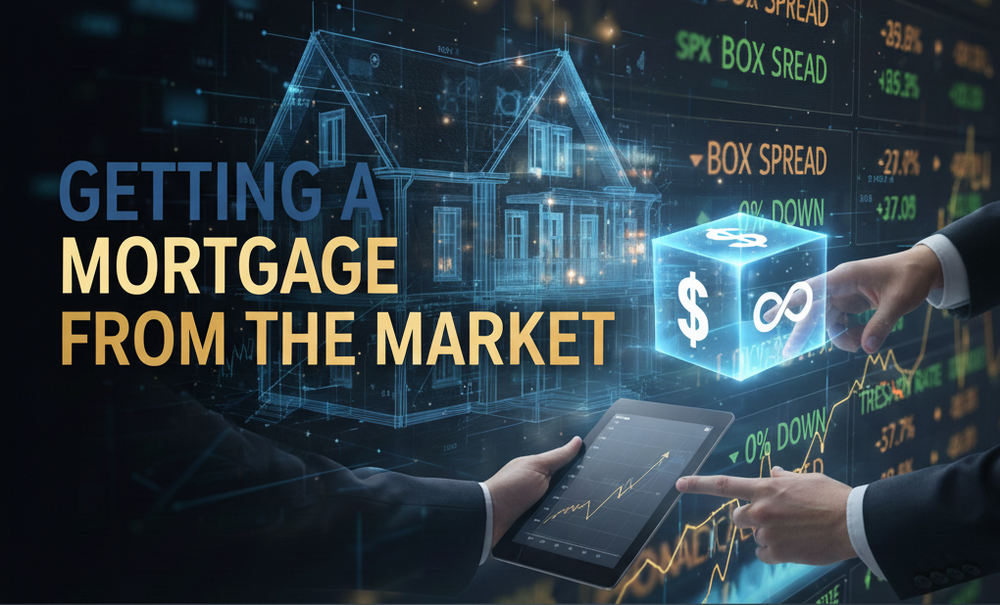

Articles showcase a select group using options to borrow money rather than a traditional Agency mortgage. Are advertisements of $0 down and near treasury-rate mortgages a fact or fiction?   

---

Imagine securing a loan for your dream home with a 0% down payment and an interest rate that rivals the U.S. Treasury. It sounds like a financial fantasy, but a niche corner of the options market, the 'box spread', has been touted online as a secret Wall Street trick to do just that. But is this a golden ticket for the average homebuyer, or a high-stakes gamble reserved for a select few? Let's break down the math, the hype, and the hidden dangers.

Today the average 30-year fixed rate mortgage is around [6.3%](https://finance.yahoo.com/personal-finance/mortgages/article/mortgage-refinance-rates-today-thursday-november-20-2025-110030633.html?utm_source=chatgpt.com&guccounter=1&guce_referrer=aHR0cHM6Ly9jaGF0Z3B0LmNvbS8&guce_referrer_sig=AQAAAGThrdddEj7J49b2DIvcxNFIX9q4DI1ccJvBuVneynvn5U9rVmMrs-uBmQ8tCZVZyPfk0uTu0i0Frgl5jbbCwGEqric4V2QxIsW8kq6QF4d280RB4vYzTpDpPrtEe230APncCw1ufLbZputPUC7NGxXCpBMxl02T61-VZw3ciI-f) yearly. Generally for mortgages it is recommended that buyers have around 20% to put as a 'down payment' at the start of the mortgage term. When trying to purchase a $1M house the math looks like the following:

Home cost:  
**$1M** 
 
Down payment:  
20% * $1M = **$200K**
 
Loan value:  
$1M - $200K = **$800K** 
 
Interest rate monthly:   
6.3%/12 = **.525% monthly**
 
Length of payments in months:  
30 years * 12 = **360 months**
 
Monthly payment:  
$800K * .525% / (1-(1 + .525%)^-360) = **$4,951.78**
 
Total interest paid:   
$4,951.78 * 360 - $800K = **$982,640.8**

There are good and bad things associated with this:

**[good]**  

1) You have effectively lowered the initial cost burden of purchasing a home. Now instead of paying $1M today, I can pay $200K today and own a home for $5K in fixed payments per month.

2) I get to enjoy the appreciation of equity value if my house raises in value. If rates decline or my home value increases, I may then be able to re-finance my home enjoying even lower rates or payments.  

**[bad]** 

1) I have to come up with $200K today. This may not be a problem for me financially, however, I don't want to have to sell large chunks of stocks or my retirement accounts in order to get the cash on hand.

2) If I for some reason cannot make my payments the bank will take my house. I will lose all of the value I had built up in home equity and still have paid lots of principal and interest for nothing.

3) If I keep to my payments and everything goes according to plan I will likely have a $800K loan that costs me $982K in interest over time to borrow that money. That is a ton of interest, more than 120% of the loan value spent and pocketed by a bank.

## The Box Spread Mortgage

First let's clarify, I am not suggesting you do this. In fact, today I am going to argue why this is not the Goldilocks scenario it is documented as in articles online. Please do not take this article as advice to go out and try and trade millions of dollars of notional volume of options to try and create yourself one of these. 

Now that that is out of the way, here is the box spread mortgage: 

> A **box-spread mortgage** is a synthetic borrowing mechanism in which a long-dated options box spread provides capital upfront in exchange for a contractually fixed repayment at maturity, effectively replicating a mortgage’s economic profile via derivative pricing.

### Creating a Box Spread Mortgage

Simply put to create a box spread we go long a call and short a put option at a strike $k_1$ and short a call and long a put at strike $k_2$. At strike $k_1$ you have effectively created a synthetic long forward. At strike $k_2$ you have created a short forward. 

It is important that the options that comprise this trade are European options. American options allow for exercising an option early, allowing for your 'balanced hedge' to fall apart whenever your counterparty decides. 

Going long a forward is equivalent to agreeing to buy an asset at a fixed-price $k_1$ in the future. Going short a forward is agreeing to sell an asset at a fixed-price $k_2$ in the future. 

Thus, when $k_2$ > $k_1$ we receive a fixed future payoff of $k_2 - k_1$. We also collect upfront the present value of this payoff discounted at the risk-free rate (or 10s of bps higher as market makers need to profit) this upfront cash flow is $PV(k_2 - k_1)$. 

So in this trade we get paid $PV(k_2 - k_1)$ and have to pay $k_2 - k_1$ in the future. This is the exact same as borrowing $k_2 - k_1$ dollars at/near the risk-free interest rate $r_f$. 

In simpler terms you can think of it this way: you simultaneously make two deals for a future date.

   1.  Deal 1: You agree to buy an asset for $1,000.

   2.  Deal 2: You agree to sell the exact same asset for $1,050.

No matter what the asset's price is on that future date, you are guaranteed to make a $50 profit. The market recognizes this guaranteed future profit and gives you its present value today: say, $48 as cash in your pocket.
  
Congratulations, you've just received $48 upfront in exchange for paying back $50 later. In essence, you've taken out a loan at a very low interest rate, with the loan amount being the present value of the spread between your two deals.

### How Much?  

Just how far from $r_f$ can you borrow? Due to recent increase in volume in the SPX box spread market, this [CBOE article](https://www.cboe.com/insights/posts/long-dated-box-spreads-a-better-way-to-buy-a-home-updated/) (which I recommend reading if you are interested in this) says to expect 30-50bps higher than treasury rates! This is astonishingly low with the 5yr sitting at 3.6% on the high end you could expect to borrow at **4.1% interest**! This is 2.2% lower than the traditional mortgage I showed earlier. 

Not to mention there are other benefits as well. I mentioned that you get paid upfront whatever you want, let's say the full 1M value of the home. In 5 years you repay $\$1M * (1.041)^5 = \$1,222,513.45$. Costing you ~200K to loan 1M over 5 years. At the comparable interest rate for the traditional mortgage this would cost around $\$1M * (1.063^5) - \$1M = \$357k$. No monthly payments as well with the box spread, just the lump sum payment at a future date of over a million dollars.  

### All the Problems

Ok first off in order to actually get one of these box loans your strategy (as a retail trader) will need to be fully collateralized at all times. This means if you are to do the $1M loan you need $1.2M+ in assets in your same brokerage account at all times. This is ok for some people however it requires a lot of capital depending on how volatile a person's investments are.

I would also guess that there is a correlation between using a box spread as a mortgage and having a higher risk appetite, but I digress.

In a bad market downturn the stock market can fall ~50% so to be safe let's say we will need to have $2.4M in equities or less if you are including less volatile fixed-income products as well. Immediately we have moved from 'easily accessible risk-free rate mortgage' to 'you need double or more in retirement assets to reasonably attempt this'.

Let's say we are fully collateralized, we are very certain we will be able to meet the liability in 5 years safely. Now we have another problem, we have to meet a 5 year liability of greater than our loan size settled in pure cash! If you were worried about selling 20% of your home value in portfolio value how about selling 120% of your home value in portfolio value in just 5 years!

Now this is not fully fair as there are likely strategies to 'kick the cash flow down the road' like rolling into a new 5 year box spread borrowing the new amount (collateralized fully by at least a 2x multiple). However, it's still said that at some point you need to present a large quantity of cash in order to settle this contract. The only way to come up with that level of cash is by selling assets or making incremental payments to set aside for the large future negative cash flow you expect. This is why in a traditional mortgage you are expected to pay down a fixed cost monthly which goes to both repaying interest and the principal which you loaned out. 

In order to effectively execute this strategy you need to be very wealthy in retirement assets which you can use as collateral covering the loan size multiple times over if you have a more volatile portfolio. You also need to have a strategy to meet the expected large negative cash flow in the future. 

If in 5 years, you need to have some plan to come up with $1.2M then rather than just coming up with the $1M today? Given you are this consumer who has vast riches in assets and is not concerned with the future cash liability why not just pay off the house today? Pushing the house/sale of retirement assets out 5 years even at the risk-free rate does not seem as worth it for this consumer since they **already have more than enough money for the loan anyway**.

Well, there are some reasons. Here are the reasons why you would want to do this. First, the interest payments show up as a loss in an options trade. This **loss is tax deductible**! This means if you are wealthy you can likely write off a large portion of the interest (leading to an almost free loan). So let's say you are fully collateralized with an investment account however you expect to have to sell off some assets in 5 years that have appreciated (incurring a capital gains tax). You also happen to be making a large purchase that you could have done outright anyway. Now we have a great scenario for you to go out to the market, borrow money using box spreads, and then generate a loss at the end of the period allowing you to:

1) Borrow money today so that you don't have to sell assets.

2) Align your planned sale of assets (likely with capital gains tax) and offset it with the loss you will generate in the synthetic loan strategy (interest payment). 

3) Pay off the full cost of the loan at the end of the period rather than the start. 

This now looks like a great trade.

Once again though I want to reiterate, this is not a good strategy for people who are under-collateralized. It is in fact an awful strategy. If the market drops and your collateral falls bellow whatever threshold your broker allows you wont be losing some fancy new home, you will be losing your life savings (and all investments). This is not a good trade for that level of risk. 

### Conclusion

There is a select group who could benefit from the box spread mortgage (or loan).

This select group is over-collateralized, has planned selling with tax implications in the future, and wants to make a purchase today. This group is **not the everyday person**, in fact far from it! Most people get a mortgage because they want to convert the large upfront cost burden of owning a home to a delayed fixed cost burden spread over many years. 

This consumer does not have enough to buy the house outright and likely does not have enough to buy several of the house within their retirement assets. Thus, if they tried the box spread mortgage they would likely get margin called during a large drawdown in the equity markets and lose everything. 

As always, till next time.

JCP