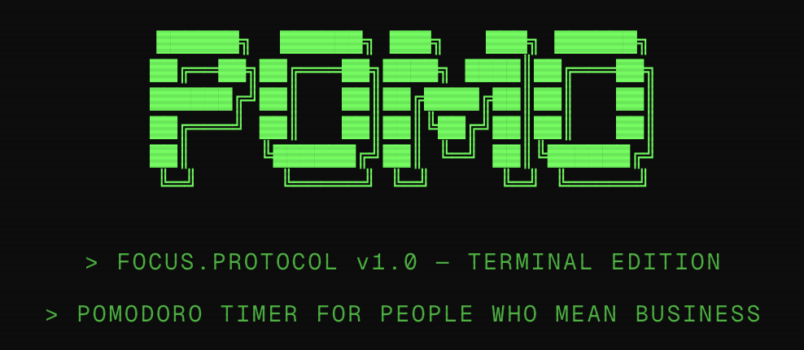

```{=html}
<div class="jcp-terminal" id="jcp-terminal">
  <div class="t-tabs" role="navigation" aria-label="Main navigation">
    <a href="/" class="t-tab"><span class="t-tab-indicator">&nbsp;</span>home</a>
    <a href="/about/" class="t-tab"><span class="t-tab-indicator">&nbsp;</span>about</a>
    <a href="/articles/" class="t-tab"><span class="t-tab-indicator">&nbsp;</span>articles</a>
    <a href="/projects/" class="t-tab t-tab-active" aria-current="page"><span class="t-tab-indicator">▸</span>projects</a>
    <a href="/contact/" class="t-tab"><span class="t-tab-indicator">&nbsp;</span>contact</a>
    <div class="t-tabs-spacer"></div>
    <div class="t-title" id="t-title">jcp@joshpearlson: ~/projects</div>
  </div>
  <div class="t-body" id="t-body" data-page="other">

    <header class="t-page-heading">
      <h1 class="t-command t-projects-heading no-anchor"><span class="t-prompt">$</span>ls ~/projects</h1>
    </header>

    <div class="jcp-proj-grid">
      <a href="https://github.com/jcpearlson/FICC-mania" class="jcp-proj-card jcp-proj-featured">
        <div class="jcp-proj-visual jcp-market-visual" aria-hidden="true">
          <span class="jcp-visual-label">FICC / MARKET DATA</span>
          <div class="jcp-market-channels"><span>01 <b>rates</b></span><span>02 <b>fx</b></span><span>03 <b>commodities</b></span></div>
          <span class="jcp-visual-foot">fixed income / currencies / commodities</span>
        </div>
        <div class="jcp-proj-info">
          <div class="jcp-proj-meta"><span>2026</span><span>Dashboard · Python</span></div>
          <h2 class="jcp-proj-title no-anchor">FICC Mania</h2>
          <p class="jcp-proj-desc">Streamlit dashboard for fixed income, currencies, and commodities, built entirely on free public data.</p>
          <div class="jcp-proj-path">View source ↗</div>
        </div>
      </a>
      <a href="https://pomo.joshpearlson.com" class="jcp-proj-card jcp-proj-featured">
        <div class="jcp-proj-visual"></div>
        <div class="jcp-proj-info">
          <div class="jcp-proj-meta"><span>2025+</span><span>Web app · JS</span></div>
          <h2 class="jcp-proj-title no-anchor">Pomo</h2>
          <p class="jcp-proj-desc">A minimal Pomodoro timer. A little structure for focused work.</p>
          <div class="jcp-proj-path">Launch app ↗</div>
        </div>
      </a>
      <a href="/articles/" class="jcp-proj-card jcp-proj-compact">
        <div class="jcp-proj-meta"><span>2024+</span><span>Blog · Writing</span></div>
        <div><h2 class="jcp-proj-title no-anchor">Priors</h2><p class="jcp-proj-desc">Personal blog on markets, ML, and probability.</p></div>
        <div class="jcp-proj-path">Read articles →</div>
      </a>
      <a href="https://openreview.net/forum?id=sfnz81T3pm" class="jcp-proj-card jcp-proj-compact">
        <div class="jcp-proj-meta"><span>2024</span><span>Research · LLM</span></div>
        <div><h2 class="jcp-proj-title no-anchor">DPFM @ ICLR 2024</h2><p class="jcp-proj-desc">LLMs recognizing DeFi entities. Lead author, DPFM workshop @ ICLR 2024.</p></div>
        <div class="jcp-proj-path">Read paper ↗</div>
      </a>
      <a href="https://doi.org/10.1117/12.2582228" class="jcp-proj-card jcp-proj-compact">
        <div class="jcp-proj-meta"><span>2020</span><span>Research · CNN</span></div>
        <div><h2 class="jcp-proj-title no-anchor">MRI Lesion Mapping</h2><p class="jcp-proj-desc">CNN-based lesion mapping from MP-MRI. Lead author, SPIE Medical Imaging.</p></div>
        <div class="jcp-proj-path">Read paper ↗</div>
      </a>
      <a href="6CardGolf/index.html" class="jcp-proj-card jcp-proj-compact">
        <div class="jcp-proj-meta"><span>2023</span><span>Card game · P2P</span></div>
        <div><h2 class="jcp-proj-title no-anchor">6-Card Golf</h2><p class="jcp-proj-desc">Browser-based 1v1 card game with P2P networking and in-game chat.</p></div>
        <div class="jcp-proj-path">Play game →</div>
      </a>
      <a href="DigDug/DigDugGame.html" class="jcp-proj-card jcp-proj-compact">
        <div class="jcp-proj-meta"><span>2022</span><span>Arcade · Canvas</span></div>
        <div><h2 class="jcp-proj-title no-anchor">Dig Dug</h2><p class="jcp-proj-desc">Classic arcade game recreation in the browser.</p></div>
        <div class="jcp-proj-path">Play game →</div>
      </a>
    </div>

  </div>
  <div class="t-status">
    <span><span class="t-status-dot">●</span> online</span>
    <span id="t-status-count">— articles · — projects</span>
    <span class="t-status-weather" id="t-status-weather">
      New York, NY
    </span>
  </div>
</div>
```
